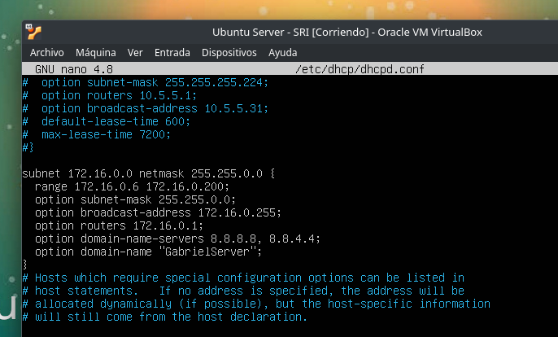
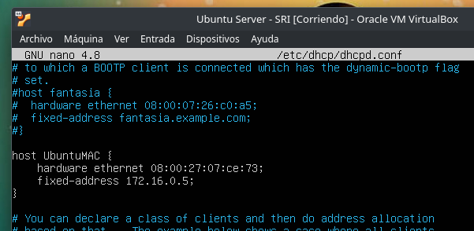
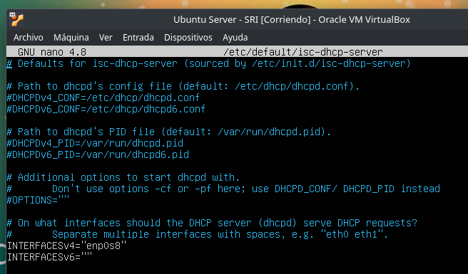
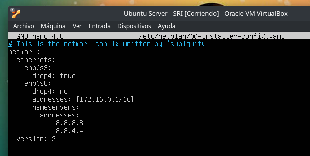
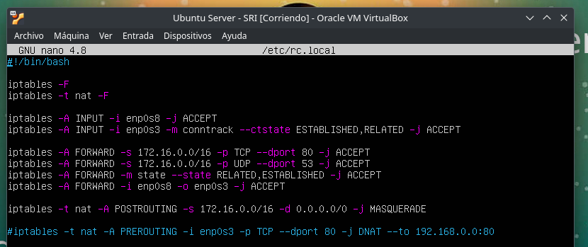
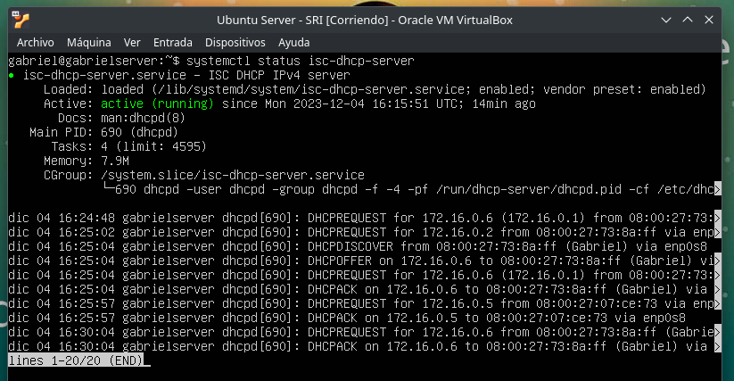
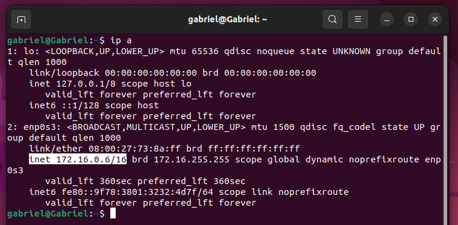
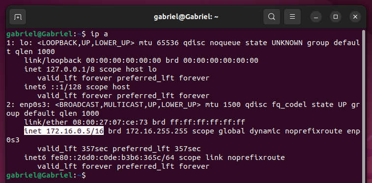
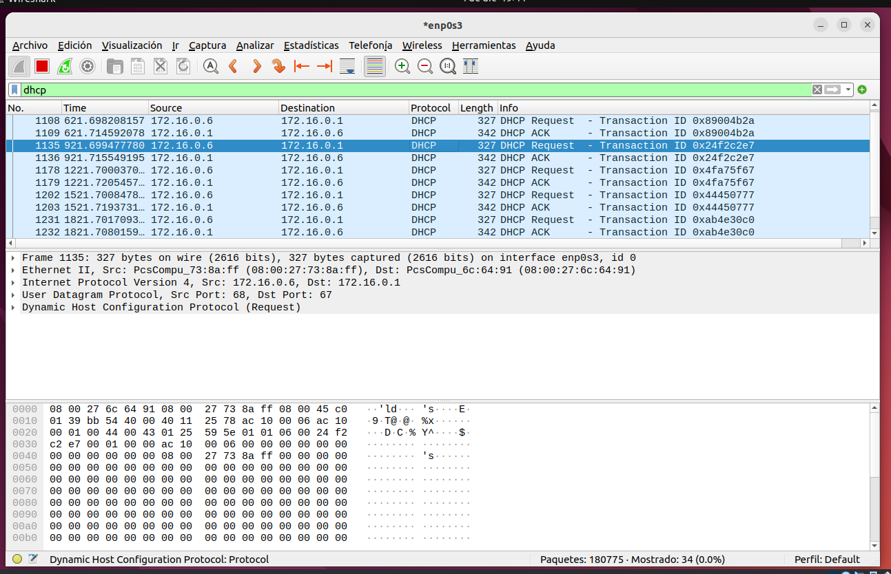

# Instalamos el paquete mendiante el uso del comando:

    sudo apt install isc-dhcp-server

# Editamos la configuración básica 

Se hace uso del fichero ***/etc/dhcp/dhcpd.conf***

Primero creamos la subred con una máscara. Luego se especifica el broadcast, el gateway, el rango y otros valores

Luego en ese mismo documento podemos decirle al servidor que le asigne una IP fija a un cliente mediante el uso de la MAC de este

Luego configuramos las interfaces en el documento ***etc/default/isc-dhcp-server***

Seguido de lo anterior se configura el documento ***/etc/netplan/00-installer-config.yaml***

Y para finalizar creamos un script para indicarle al sevidor el funcionamiento deseado. Este script se lanzará cada vez que se reinicie el servidor

# Comprobamos su funcionamiento

# Ahora revisaremos los clientes

Cliente con IP dińamica

Cliente con IP fija mendiante uso de su MAC

Podemos comprobar los paquetes DHCP mediante el uso de Wireshark

